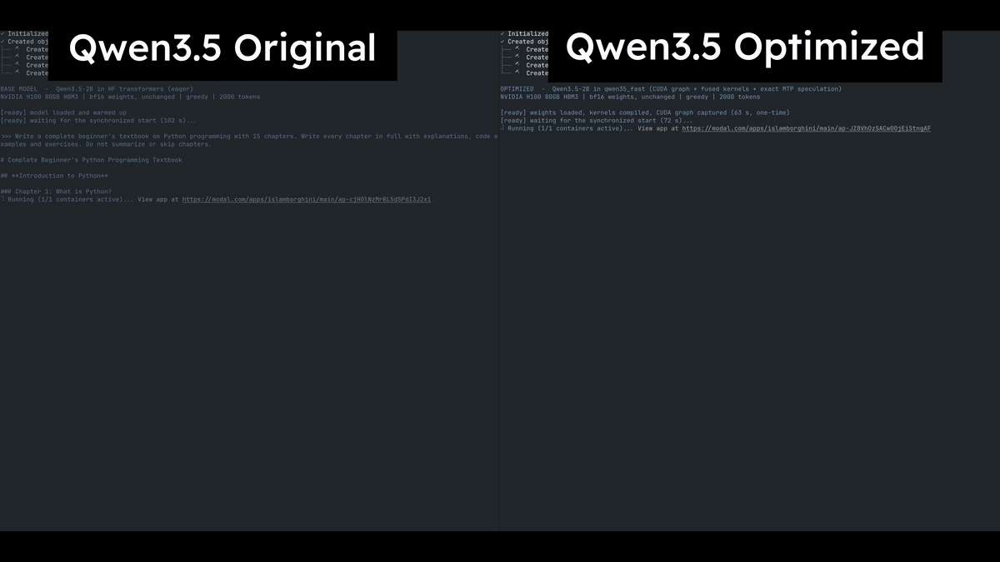

# Qwen3.5-2B, auto-optimized by Fable

[](https://raw.githubusercontent.com/islamborghini/Qwen3.5-2B-auto-optimized/main/assets/qwen35-fable-demo.mp4)

[▶ Watch the 25-second side-by-side demo](https://raw.githubusercontent.com/islamborghini/Qwen3.5-2B-auto-optimized/main/assets/qwen35-fable-demo.mp4)

Claude Fable auto-optimized [Qwen3.5-2B](https://huggingface.co/Qwen/Qwen3.5-2B) for single-request text generation. The [model and optimized engine are on Hugging Face](https://huggingface.co/islamassanov/Qwen3.5-2B-auto-optimized); Qwen's BF16 weights are unchanged.

| One H100, batch 1, 256 output tokens | Decode tokens/s |
|---|---:|
| Transformers eager | 50–51 |
| vLLM 0.29 | 429–437 |
| vLLM 0.29 + MTP | 527–915 |
| **Fable-optimized engine** | **582–848** |

Across 12 development workloads, the Fable engine delivered **14×** the decode speed of Transformers eager and **1.02×** the speed of vLLM with MTP (geometric means). Across 12 held-out workloads, it reached **528–866 tokens/s** and **1.01×** vLLM with MTP.

## Setup

Use Python 3.12 and an NVIDIA CUDA GPU:

```bash
git clone https://github.com/islamborghini/Qwen3.5-2B-auto-optimized.git
cd Qwen3.5-2B-auto-optimized
python3.12 -m venv .venv
source .venv/bin/activate
pip install huggingface_hub
hf download islamassanov/Qwen3.5-2B-auto-optimized --local-dir .cache/model
pip install -r .cache/model/requirements.txt
```

```python
from transformers import AutoTokenizer
from qwen35_fast.engine import Engine

tokenizer = AutoTokenizer.from_pretrained(".cache/model")
messages = [{"role": "user", "content": "Explain how a CPU cache hierarchy works."}]
input_ids = tokenizer.apply_chat_template(
    messages, tokenize=True, add_generation_prompt=True, enable_thinking=False
)["input_ids"]

engine = Engine(".cache/model", spec_k=2, compile_blocks=True, fused_gdn=True)
output = engine.generate(
    input_ids,
    n_out=512,
    eos_ids={tokenizer.eos_token_id, tokenizer.convert_tokens_to_ids("<|im_end|>")},
)
print(tokenizer.decode(output["tokens"], skip_special_tokens=True))
```

## What Fable changed

- Captured decoding in a CUDA graph to reduce launch overhead.
- Fused decode operations with `torch.compile` and Triton Gated-DeltaNet kernels.
- Used Qwen's MTP head to propose two tokens per step, accepting each only when the target model makes the same greedy choice.

The optimized path runs batch-1, greedy, non-thinking text generation with Qwen's original BF16 weights and tokenizer.

## Benchmarks

Results are median decode tokens/s over five runs on one H100 SXM. The prompts cover prose, code, and structured output at 128, 512, 2,048, and 8,192 input tokens; each run generates 256 tokens.

| Development prompts | Transformers eager | vLLM + MTP | Fable engine |
|---|---:|---:|---:|
| Prose, 128–8,192 input tokens | 50–51 | 528–576 | **582–618** |
| Code, 128–8,192 input tokens | 50–51 | 637–736 | **661–738** |
| Structured, 128–8,192 input tokens | 50–51 | 824–915 | **807–848** |

See the [full results](results/RESULTS.md), [frozen prompts](bench/workloads.json), and [benchmark code](bench/). The [session ledger](LEDGER.md) records the optimization runs.
